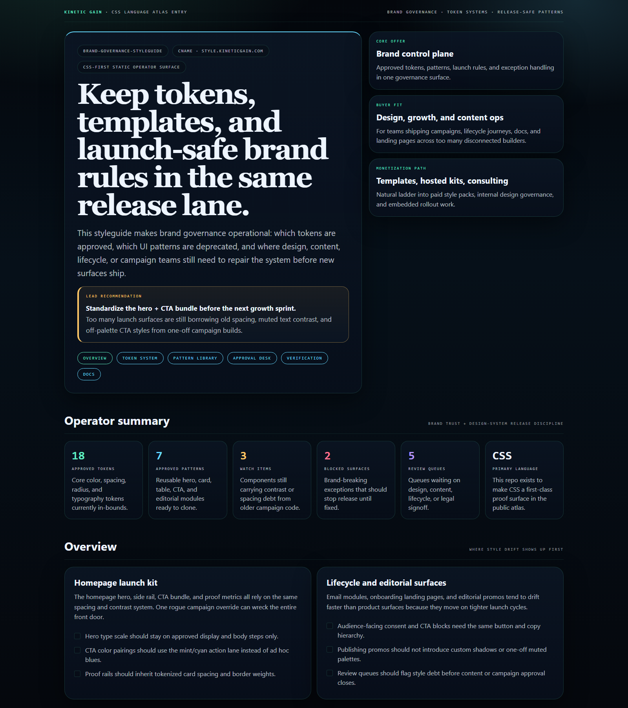
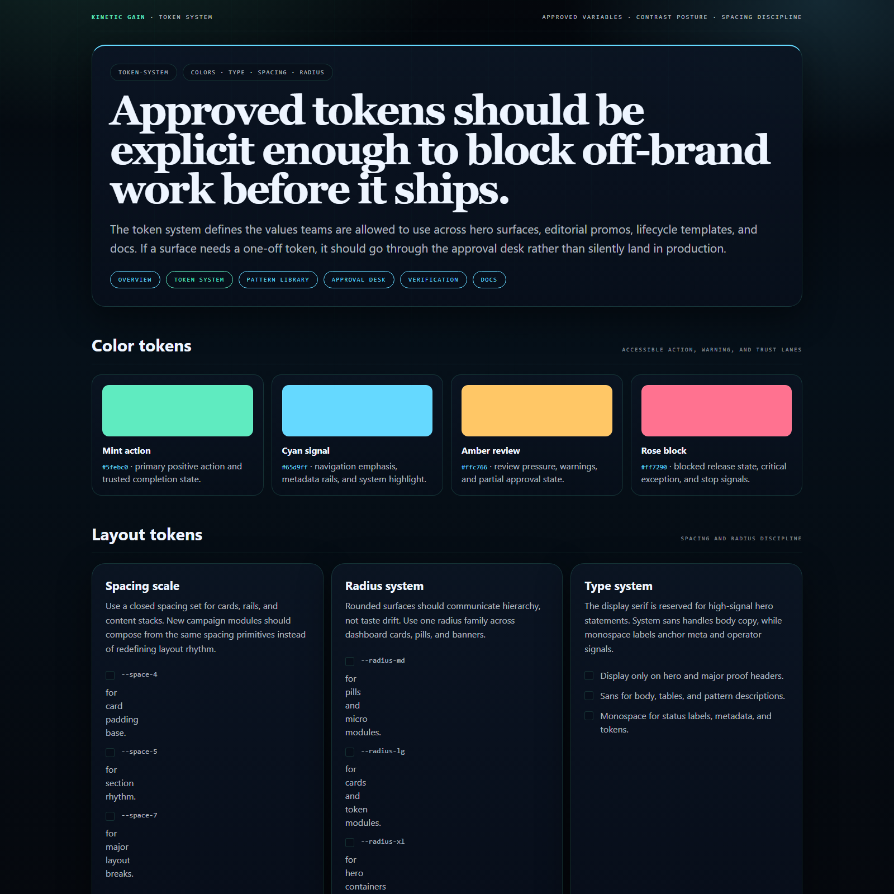
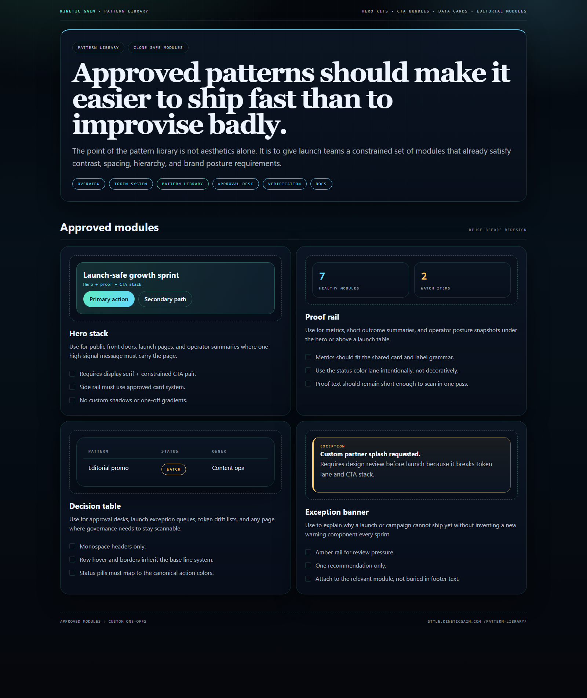
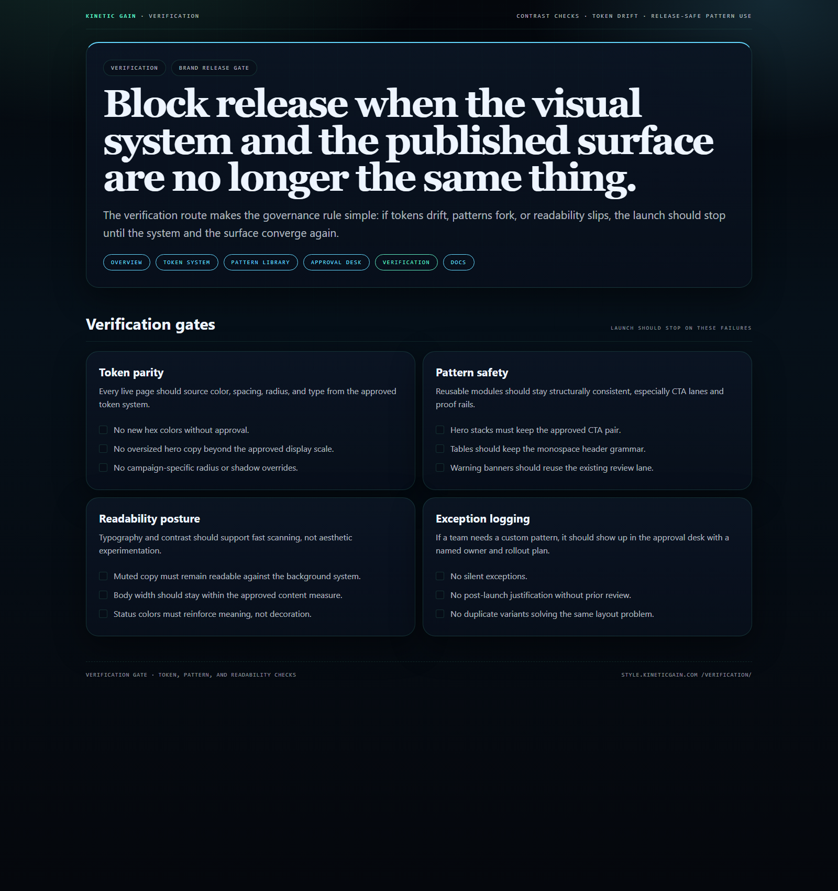

# brand-governance-styleguide

CSS-first operator surface for brand governance: design tokens, component usage rules, approval-ready patterns, and release-safe style posture for marketing, editorial, and product teams.

## Why this exists

- Brand systems usually drift between Figma, CMS blocks, campaign builders, and ad hoc landing pages.
- Growth, design, content, and compliance teams need one visible source of truth for which tokens are approved, which patterns are deprecated, and what should block release.
- A public portfolio needs a real CSS-heavy repo in the language atlas, not another dashboard with styles sprinkled on top.

## Why this matters (KG Embedded tie-back)

This repo shows the design-system governance primitive for Kinetic Gain Embedded: approved tokens, publish-safe patterns, and rollout discipline exposed through one operator surface. In a real embedded setting, the same structure can power hosted brand kits, template packs, and consulting-led design governance.

## Routes

- `/`
- `/token-system/`
- `/pattern-library/`
- `/approval-desk/`
- `/verification/`
- `/docs/`

## Screenshots






## Local development

```powershell
cd brand-governance-styleguide
powershell -ExecutionPolicy Bypass -File .\scripts\build.ps1
py -3 -m http.server 5488 --bind 127.0.0.1 --directory site
```

Open:
- [http://127.0.0.1:5488/](http://127.0.0.1:5488/)
- [http://127.0.0.1:5488/token-system/](http://127.0.0.1:5488/token-system/)
- [http://127.0.0.1:5488/pattern-library/](http://127.0.0.1:5488/pattern-library/)
- [http://127.0.0.1:5488/approval-desk/](http://127.0.0.1:5488/approval-desk/)
- [http://127.0.0.1:5488/verification/](http://127.0.0.1:5488/verification/)
- [http://127.0.0.1:5488/docs/](http://127.0.0.1:5488/docs/)

## Validation

- `powershell -ExecutionPolicy Bypass -File .\scripts\build.ps1`
- `powershell -ExecutionPolicy Bypass -File .\scripts\smoke_check.ps1`
- `powershell -ExecutionPolicy Bypass -File .\scripts\render_readme_assets.ps1`

## Production status

| Aspect | Status |
|--------|--------|
| License | [AGPL-3.0-or-later](./LICENSE) |
| Security | [SECURITY.md](./SECURITY.md) |
| Deploy | Static Pages bundle -> **https://style.kineticgain.com/** |
| Primary language | `CSS` |

## Docs

- [Architecture](./docs/architecture.md)
- [Origin](./docs/ORIGIN.md)
- [Kinetic Gain Embedded tie-back](./docs/KINETIC_GAIN_EMBEDDED.md)
- [Changelog](./CHANGELOG.md)

## Part of the Kinetic Gain Suite

Operator surface in the [Kinetic Gain Suite](https://suite.kineticgain.com/) — a portfolio of buyer-readable control planes spanning compliance evidence, lifecycle governance, identity posture, FinOps, content systems, and operator workflows. Apex: [kineticgain.com](https://kineticgain.com/).

